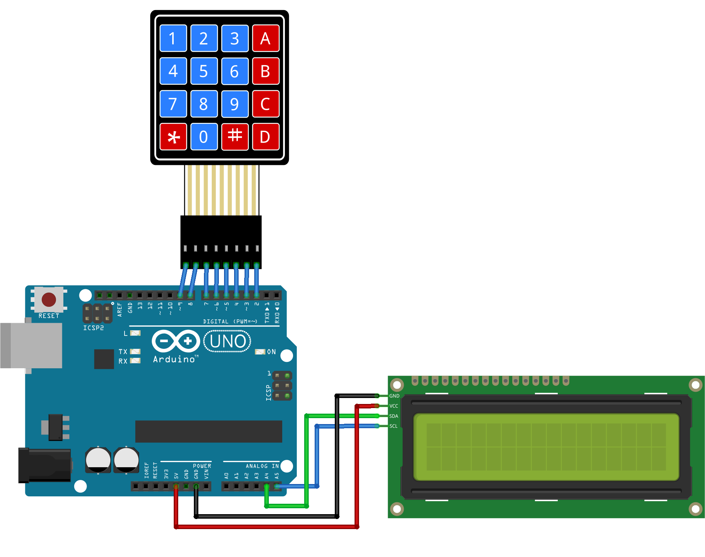

# Calculadora

## Conexiones



## Librería

```sh
$ wget https://playground.arduino.cc/uploads/Code/keypad/index.zip && unzip index.zip
$ mv Keypad ~/Arduino/libraries/
$ wget https://www.circuitbasics.com/wp-content/uploads/2017/04/LiquidCrystal_I2C.zip && LiquidCrystal_I2C.zip
$ mv LiquidCrystal_I2C ~/Arduino/libraries/
```
## codigo.cpp

```cpp
#include <Wire.h> 
#include <LiquidCrystal_I2C.h>
LiquidCrystal_I2C lcd(0x27,16,2);
#include <Keypad.h>
const byte ROWS = 4;
const byte COLS = 4;
char hexaKeys[ROWS][COLS] = {
  {'1', '2', '3', '+'},
  {'4', '5', '6', '-'},
  {'7', '8', '9', '*'},
  {'C', '0', '=', '/'}
};
byte rowPins[ROWS] = {9, 8, 7, 6};
byte colPins[COLS] = {5, 4, 3, 2};
Keypad customKeypad = Keypad(makeKeymap(hexaKeys), rowPins, colPins, ROWS, COLS);
void setup(){lcd.init();lcd.backlight();}
void operacion(String a,String b,char c){
    int x=a.toInt(),y=b.toInt();
    lcd.clear();
    switch(c){
        case '+': lcd.print(x+y);break;
        case '-': lcd.print(x-y);break;
        case '*': lcd.print(x*y);break;
        case '/': lcd.print(x/y);break;
    }
}
String a,b;
void loop(){
  char c=customKeypad.getKey(),d;
  if(c){
    if(c-'0'>=0 && c-'0'<=9){ a+=c;lcd.clear();lcd.print("c="+a);
    }else if(c=='+' || c=='-' || c=='*' || c=='/'){
        lcd.clear();lcd.print(c);
        bool z=true;
        while(z){
            d=customKeypad.getKey();
            if(d){
                if(d-'0'>=0 && d-'0'<=9){ b+=d;lcd.clear();lcd.print("c="+b);}
                else z=false;
            }
        }
        if(d=='='){operacion(a,b,c);a="";b="";}
    }else if(c=='C'){lcd.clear();a="";b="";}
  }
}
```
