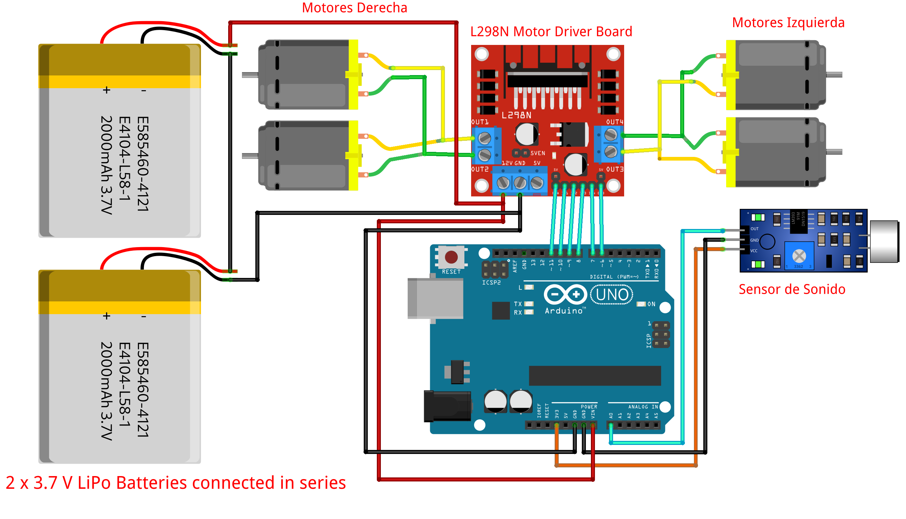

# Controlar la velocidad de un carrito con la intensidad del sonido

El carrito va a avanzar siempre y cuando haya un ruido que pueda detectar. La intensidad de tal sonido hará que se mueva a una determinada velocidad.


## Conexiones



## codigo.ino

```cpp
int enA=11,IN1=10,IN2=9,IN3=8,IN4=7,enB=6;
const int pinSignal = A0;
void parar(){
  for(int i=7;i<=10;i++) digitalWrite(i,LOW);
}
void mover(int i,int j){
  digitalWrite(i,HIGH);
  digitalWrite(j,LOW);
}
void adelante(){
    mover(IN1,IN2);
    mover(IN3,IN4);
}
void modificar_velocidad(int velocidad){
    analogWrite(enA,velocidad);
    analogWrite(enB,velocidad);
    delay(50);
}
int nivel_sonido(){
  long sum = 0;
  int num_Medidas = 128;
  for(int i = 0; i < num_Medidas; i++) sum += analogRead(pinSignal);
  long nivel = sum / num_Medidas;
  return nivel-20; //Un ajuste
}
void rango_sonido(long nivel){
  if(nivel < 40){
      Serial.print("Nivel Bajo: ");
      Serial.println(nivel);
  }else if (nivel < 500){
      Serial.print("Nivel Medio: ");
      Serial.println(nivel);
  }else{
      Serial.print("Nivel Alto: ");
      Serial.println(nivel);
  }
}
void setup(){
  Serial.begin(9600);
  for(int i=6;i<=11;i++) pinMode(i,OUTPUT);
  pinMode(pinSignal, INPUT);
  adelante();
}
void loop(){
    int nivel = nivel_sonido();
    int velocidad = map(nivel, 0, 1023, 0, 255)*2;
    modificar_velocidad(velocidad);
    Serial.println(velocidad);
    if(velocidad > 90) delay(1000);
}
```

## Demo

https://github.com/lilberick/Arduino/assets/20149673/1a27d7c3-5c6d-41eb-9e4c-f021640e3748

